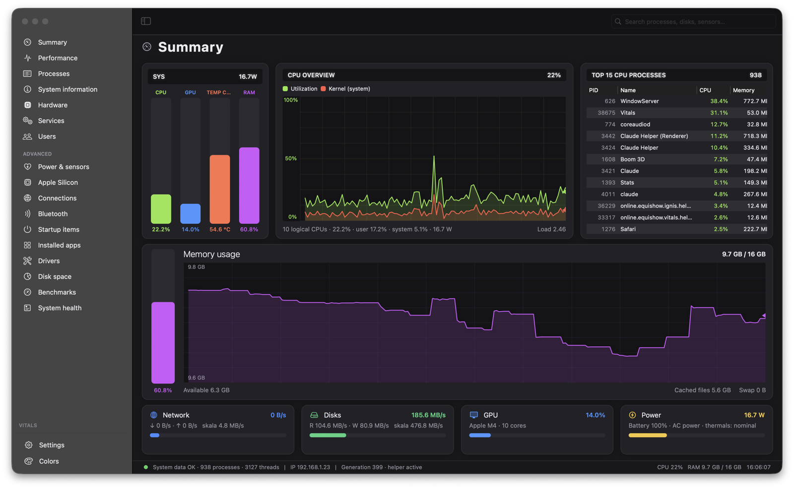
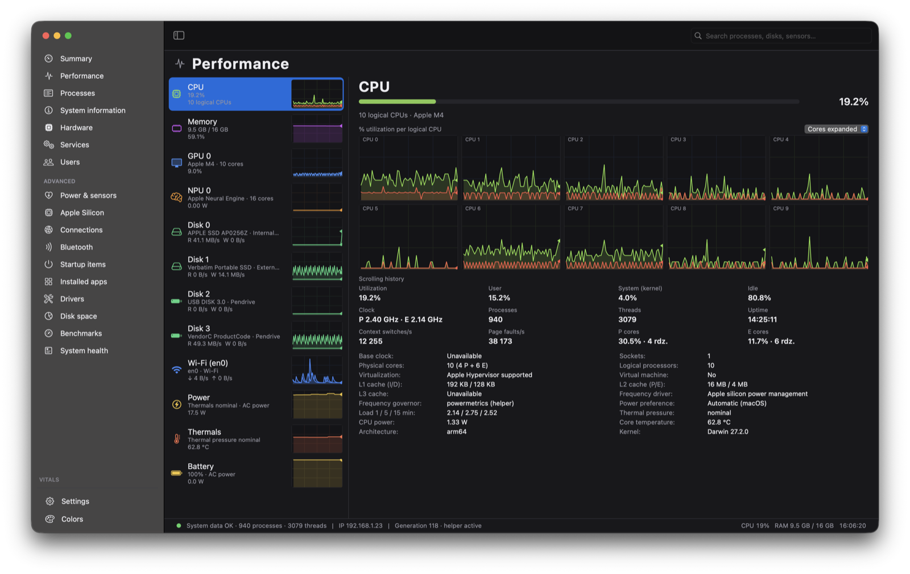
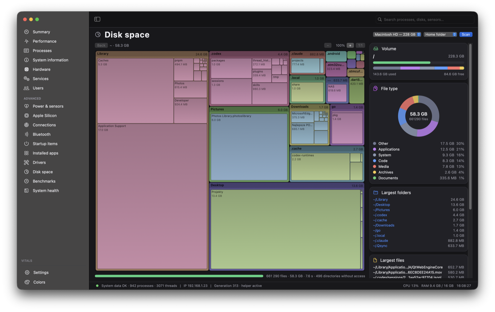
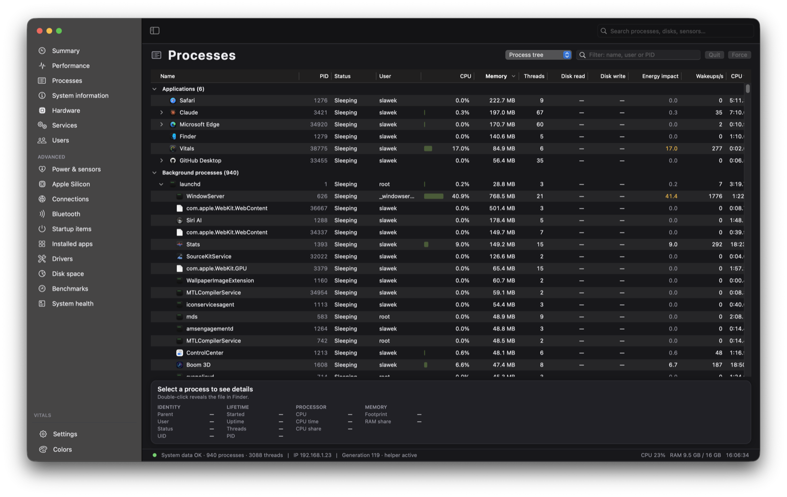
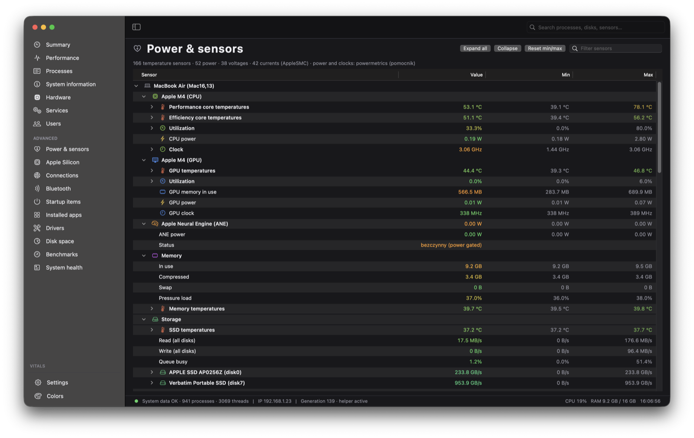
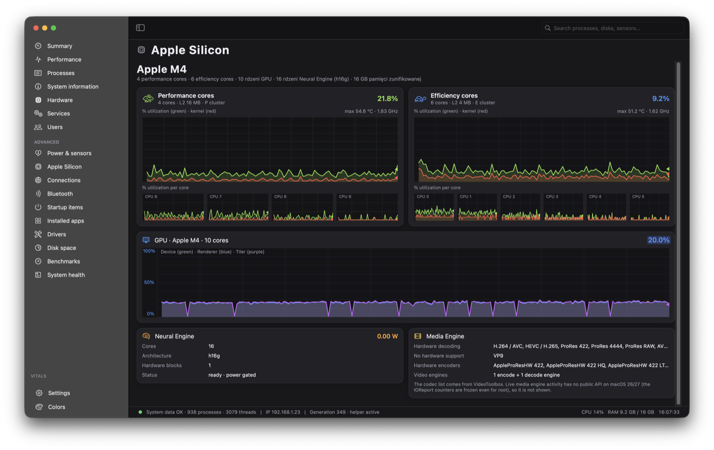
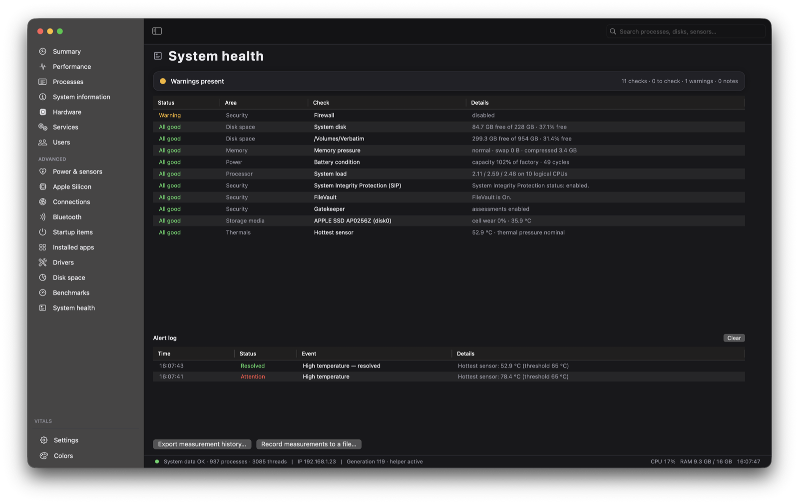

<div align="center">

# Vitals

**A native system monitor for macOS.** Processes, sensors, disks, network and machine health in one window — no Electron, no third-party dependencies, no telemetry.

[](https://www.apple.com/macos/)
[](https://swift.org)
[](https://developer.apple.com/documentation/appkit)
[](#)
[](#)
[](LICENSE)

**English** · [Polski](README.md)

</div>



<table>
<tr>
<td width="50%"><br><sub><b>Performance</b> — every core, disk and interface on its own</sub></td>
<td width="50%"><br><sub><b>Disk space</b> — treemap with drill-down and zoom</sub></td>
</tr>
<tr>
<td><br><sub><b>Processes</b> — PPID tree, energy, wakeups, signals</sub></td>
<td><br><sub><b>Power &amp; sensors</b> — the whole SMC with min/max</sub></td>
</tr>
<tr>
<td><br><sub><b>Apple Silicon</b> — P/E clusters, GPU, Neural Engine</sub></td>
<td><br><sub><b>System health</b> — checks, alerts, event log</sub></td>
</tr>
</table>

---

## What it does

| | |
|---|---|
| **Summary** | CPU / GPU / temperature / RAM meters, system power from SMC, top 15 processes and tiles for network, disks and power. The graphs respond to the mouse: hovering rewinds the process list to that moment, dragging averages a range. |
| **Performance** | A separate entry for every device: P/E cores, memory, GPU, Neural Engine, **each physical disk** (type, architecture — NVMe / USB / SATA / card reader — and SMART) and **each network interface** (Wi-Fi with SSID, Ethernet, hotspot, Bluetooth PAN, VPN tunnel with the profile name). |
| **Processes** | A PPID tree with app icons, columns for CPU / memory / threads / disk R-W / energy impact / wakeups, quitting and signals, priority (nice), process sampling, exited processes highlighted for 8 s. |
| **Power & sensors** | The full SMC tree: temperatures, power, voltages, currents, fans — each with current value, minimum and maximum, colored against Apple silicon thresholds. |
| **Apple Silicon** | P/E clusters with a graph per core, GPU (device / renderer / tiler), Neural Engine, media engine with the codec list. |
| **Disk space** | Fast scanning through `getattrlistbulk` (in parallel), a treemap with drill-down and **zoom**, a file category ring, largest folders and files, moving items to the Trash. |
| **System health** | Checks for free space, SMART, battery, thermals, memory, load, zombie processes and security (SIP, FileVault, Gatekeeper, firewall) with an event log. |
| **Alerts** | Thresholds for temperature, CPU, swap, free space, battery and a single process — with macOS notifications. |
| **Benchmarks** | Selectable tests: CPU (single core / all cores), memory bandwidth, sequential disk write and read, GPU compute in Metal. Result history and CSV export. |
| **And the rest** | launchd services with actions, users with their processes, TCP/UDP connections, Bluetooth, startup items, installed apps, drivers and kernel extensions, system and hardware information. |

On top of that: **Polish and English switched on the fly** (no restart), light / dark / monochrome phosphor themes, configurable columns in every table, a menu bar item, measurement history exported to CSV.

## Install

Download `Vitals-<version>.zip` from the [releases](../../releases/latest), unpack it and move **Vitals.app** to `/Applications`.

The app checks for updates on its own (once a day, and on demand from **Vitals → Check for Updates…**). A new version is downloaded only after you agree, and before installing it the signature, team identifier and bundle identifier are verified.

## Privileges

macOS exposes CPU and memory of other users' processes, as well as the CPU / GPU / Neural Engine energy counters, only to processes with administrator privileges. Without them some fields show “No access”. There are two ways around it:

- **Privileged helper** (recommended) — one authorization, then no prompts at launch.
- **Restart as administrator** — a password every time you start the app.

<details>
<summary>How to enable the helper and what it does</summary>

The bundle ships a daemon called `online.equishow.vitals.helper`. The app first tries `SMAppService` (approval in Login Items); when macOS rejects a daemon signed with a personal team certificate, it falls back to `SMJobBless`: a single authorization installs the helper into `/Library/PrivilegedHelperTools`. Over XPC the helper provides the full process list, power readings (`powermetrics`) and launchd service actions. Enable it in **Settings → Helper and privileges → “Enable helper…”**, disable it with the same button (which removes the plist and the binary).

Building the helper requires an **Apple Development** certificate (a free Apple ID is enough) — the `SMAuthorizedClients` / `SMPrivilegedExecutables` rules are generated from the certificate's OU at build time:

1. Xcode → Settings… → Accounts → “+” → sign in with your Apple ID.
2. Personal Team → Manage Certificates… → “+” → **Apple Development**.
3. `security find-identity -v -p codesigning` prints e.g. `"Apple Development: Jane Doe (ABCDE12345)"`.
4. `CODESIGN_IDENTITY="Apple Development: Jane Doe (ABCDE12345)" ./build.sh`

If `security find-identity -v` reports “0 valid identities”, the Apple WWDR G3 intermediate certificate is missing:
`curl -O https://www.apple.com/certificateauthority/AppleWWDRCAG3.cer && security import AppleWWDRCAG3.cer -k ~/Library/Keychains/login.keychain-db`

Without a certificate the bundle gets an ad-hoc signature: the app runs, but the helper cannot be installed.

</details>

> **A note on energy counters**: on macOS 26/27 the IOReport “Energy Model” is frozen for everything except Apple's own tools, root included — so without the helper the CPU / GPU / ANE power fields show “—”. System and charger power comes from SMC and always works. With the helper the app reads `powermetrics` and shows power plus the real P/E cluster and GPU clocks.

## Building from source

Requires Xcode 15+ (Swift 5.9+). No external dependencies.

```bash
git clone https://github.com/slawek19926/Vitals.git
cd Vitals
./build.sh                                   # release → build/Vitals.app
open build/Vitals.app
```

Signed build (required for the helper) and publishing a GitHub release:

```bash
CODESIGN_IDENTITY="Apple Development: Jane Doe (TEAMID)" ./build.sh
CODESIGN_IDENTITY="Apple Development: Jane Doe (TEAMID)" ./release.sh --publish --notes "What changed"
```

`open Package.swift` opens the project in Xcode (scheme `Vitals`). Breakpoints work both in Swift and in the C++ under `Sources/SysCore`.

## How it works

```
Sources/SysCore    C++17: libproc / sysctl / Mach (processes, CPU, memory), IOKit (disks, battery,
                   GPU, ANE), AppleSMC (temperatures, power), IOReport (energy). Plain C API.
Sources/App        Swift + AppKit: Monitor (background sampling), Theme (palettes), L10n
                   (translations), SystemHealth, Alerts, HistoryExport, Updater, Views/, Controllers/.
Sources/Helper     The privileged helper (XPC), Sources/HelperKit – shared protocol and version.
```

Sampling runs on its own background queue (10 times per second for cheap reads by default, less often for SMC and XPC), graphs are drawn by Core Animation, and pages refresh only while visible — which is why the app uses a fraction of a core instead of heating one up.

`Resources/Version.config` holds `MAJOR.MINOR.PATCH.BUILD`; the build number is bumped by every `./build.sh` and lands in `Info.plist`, the About window and release tags.

## Privacy

The app sends no data anywhere. Its only network request asks the GitHub API for the latest release — and that can be turned off in Settings.

## License

© 2026 Sławomir Sendra. The code is available under the [GNU GPL v3](LICENSE).

- You may use, study, modify and redistribute it — including in your own projects.
- If you distribute your own version, you must publish its full source under the same license. A closed, commercial product built on this code is not allowed.
- Copyright stays with the author, who is the only one able to release Vitals under different terms (for example a paid edition, or distribution through the Mac App Store, where the GPL does not apply).
- The **Vitals** name, the icon and the signing certificate are not covered by the code license. A fork has to use its own name and its own signature; the update channel accepts only bundles with a matching team identifier.

Want the code under terms other than the GPL? Write to the author.

---

<div align="center">
<sub>Built with Swift and C++ for macOS on Apple silicon.</sub>
</div>
