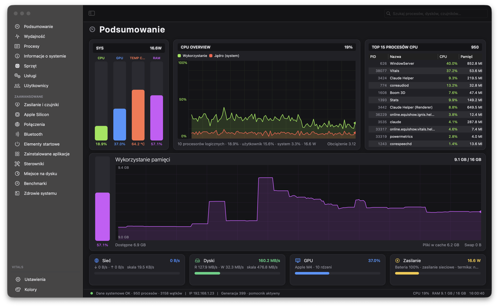
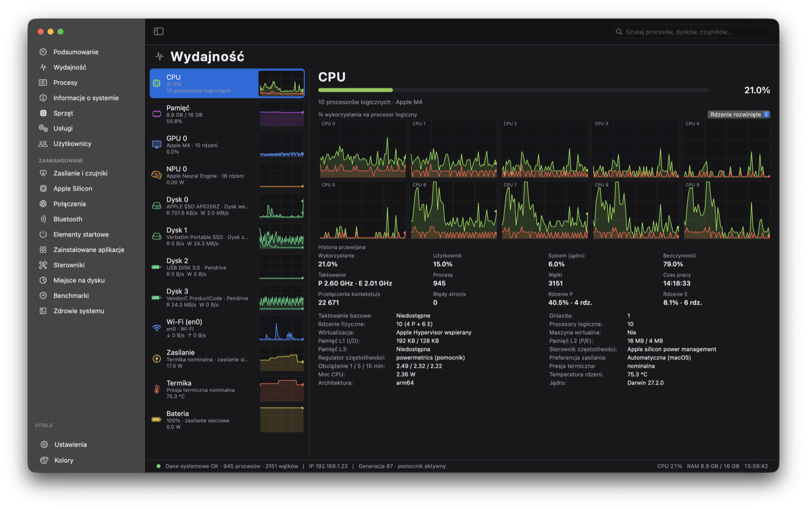
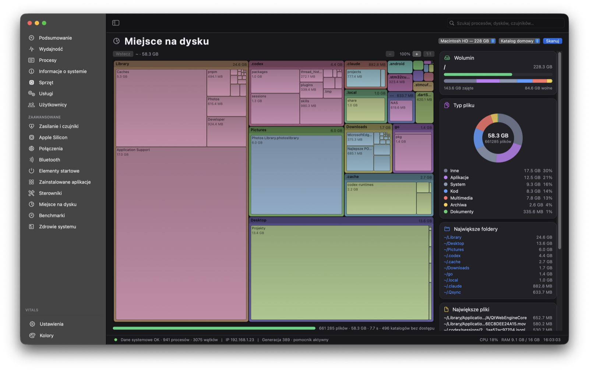
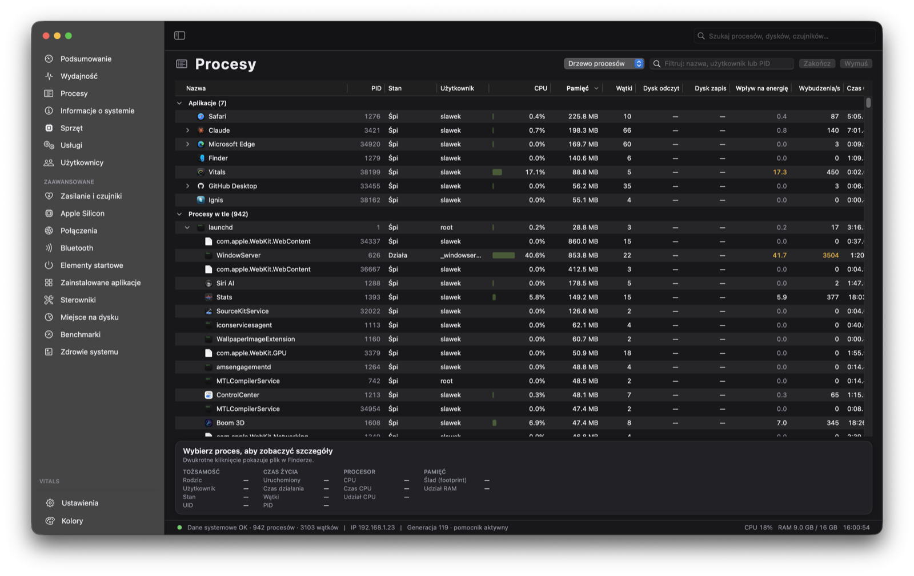
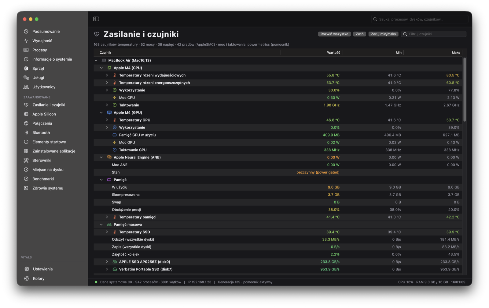
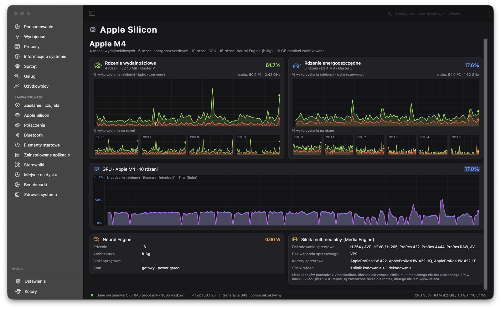
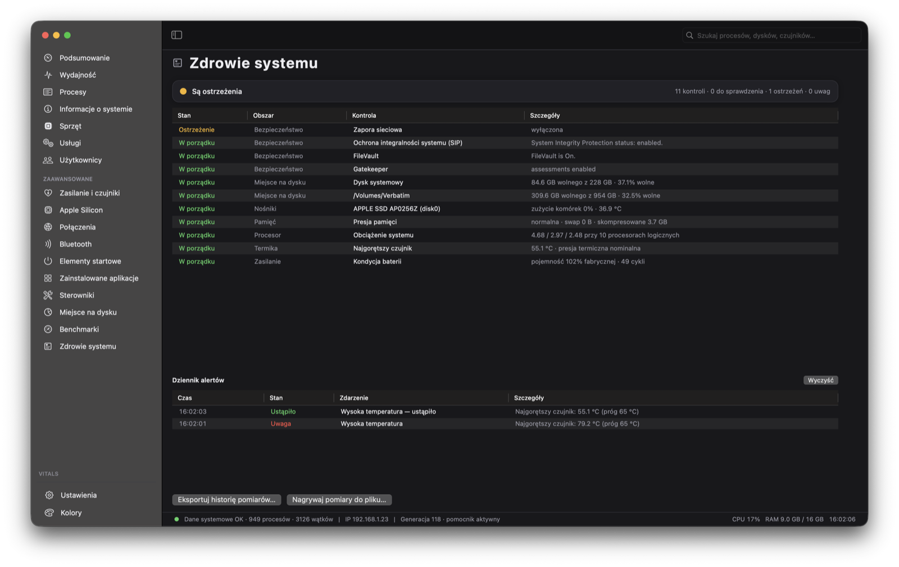

<div align="center">

# Vitals

### Natywny, open-source monitor systemu dla macOS i Apple Silicon

CPU, GPU, Neural Engine, SMC, procesy, dyski, sieć, SMART, benchmarki i zdrowie systemu — w jednym szybkim, natywnym narzędziu.

**Bez Electrona. Bez telemetrii. Bez zewnętrznych zależności.**

[](../../releases/latest)
[](../../stargazers)
[](https://ko-fi.com/slawek19926)

> **Wesprzyj Vitals:** wpłaty idą na Apple Developer Program potrzebny do podpisanych i notaryzowanych wydań, łatwiejszej instalacji pomocnika oraz przyszłej dystrybucji przez Homebrew.

[](../../releases/latest)
[](../../releases)
[](../../stargazers)
[](https://www.apple.com/macos/)
[](https://swift.org)
[](https://developer.apple.com/documentation/appkit)
[](#)
[](#)
[](LICENSE)
[](#wsparcie)

[English](README.md) · **Polski**

</div>

> **Dlaczego Vitals?** Dostajesz głębszy wgląd niż w Monitor aktywności: klastry P/E, GPU i Neural Engine, dostępne odczyty SMC, per-dysk i per-interfejs monitoring, SMART, energię procesów, benchmarki i diagnostykę zdrowia systemu — bez wysyłania danych poza Maca.



<table>
<tr>
<td width="50%"><br><sub><b>Wydajność</b> — każdy rdzeń, dysk i interfejs osobno</sub></td>
<td width="50%"><br><sub><b>Miejsce na dysku</b> — treemap z drążeniem i powiększaniem</sub></td>
</tr>
<tr>
<td><br><sub><b>Procesy</b> — drzewo po PPID, energia, wybudzenia, sygnały</sub></td>
<td><br><sub><b>Zasilanie i czujniki</b> — całe SMC z min/maks</sub></td>
</tr>
<tr>
<td><br><sub><b>Apple Silicon</b> — klastry P/E, GPU, Neural Engine</sub></td>
<td><br><sub><b>Zdrowie systemu</b> — kontrole, alerty, dziennik</sub></td>
</tr>
</table>

---

## Co potrafi

| | |
|---|---|
| **Podsumowanie** | Mierniki CPU / GPU / temperatury / RAM, moc systemu z SMC, TOP 15 procesów i kafelki sieci, dysków oraz zasilania. Wykresy reagują na mysz: najechanie cofa listę procesów do wybranej chwili, przeciągnięcie uśrednia przedział. |
| **Wydajność** | Osobna pozycja dla każdego urządzenia: rdzenie P/E, pamięć, GPU, Neural Engine, **każdy dysk fizyczny** (typ, architektura NVMe / USB / SATA / czytnik kart, SMART) i **każdy interfejs sieciowy** (Wi-Fi z SSID, Ethernet, hotspot, Bluetooth PAN, tunel VPN z nazwą profilu). |
| **Procesy** | Drzewo po PPID z ikonami aplikacji, kolumny CPU / pamięć / wątki / dysk R-W / wpływ na energię / wybudzenia, kończenie i sygnały, priorytet (nice), próbkowanie procesu, zakończone podświetlone przez 8 s. |
| **Zasilanie i czujniki** | Zmierzone temperatury i obroty wentylatorów SMC, potwierdzone odczyty szyn zasilania (moc, napięcie i prąd), dane baterii oraz moc podsystemów. Ustawienia, wartości docelowe i niezrozumiałe klucze SMC są pomijane; macOS nie udostępnia każdego fizycznego czujnika. |
| **Apple Silicon** | Klastry P/E z wykresem per rdzeń, GPU (urządzenie / renderer / tiler), Neural Engine, silnik multimedialny z listą kodeków. |
| **Miejsce na dysku** | Skanowanie przez `getattrlistbulk` (równolegle), treemap z drążeniem i **powiększaniem**, pierścień kategorii, największe foldery i pliki, usuwanie do Kosza. |
| **Zdrowie systemu** | Kontrole miejsca, SMART, baterii, termiki, pamięci, obciążenia, procesów zombie i zabezpieczeń (SIP, FileVault, Gatekeeper, zapora) z dziennikiem zdarzeń. |
| **Alerty** | Progi temperatury, CPU, swapu, wolnego miejsca, baterii i pojedynczego procesu — z powiadomieniami macOS. |
| **Benchmarki** | Wybierane testy: CPU (jeden rdzeń / wszystkie), przepustowość pamięci, zapis i odczyt dysku, obliczenia GPU w Metalu. Historia wyników i eksport CSV. |
| **Panele i pasek menu** | Pływające panele na pulpicie (CPU, pamięć, GPU, temperatura, sieć, dyski, zasilanie) z wykresem na żywo, przeciąganiem i regulowaną przezroczystością. W pasku menu osobna pozycja na metrykę — z wartością, mini wykresem albo obojgiem; lewy przycisk otwiera panel z wykresami i najcięższymi procesami. |
| **Reszta** | Usługi launchd z akcjami, użytkownicy z procesami, połączenia TCP/UDP pogrupowane według aplikacji i celu (cel można rozwinąć, by zobaczyć gniazda i porty lokalne; dostępny jest też widok gniazd i filtry zdalnych/nasłuchujących/lokalnych), Bluetooth z listą połączonych/sparowanych urządzeń i skanowaniem pobliskich BLE na żądanie, elementy startowe, zainstalowane aplikacje, sterowniki i rozszerzenia jądra, informacje o systemie i sprzęcie. |

Dodatkowo: **polski i angielski przełączane w locie** (bez restartu), **uruchamianie po zalogowaniu** i praca w tle (zamknięcie okna zostawia aplikację w pasku menu, a próbkowanie zwalnia), motywy jasny / ciemny / monochromatyczny fosfor, konfigurowalne kolumny w każdej tabeli, eksport historii pomiarów do CSV.

Zmiany w wydaniach opisuje [changelog](CHANGELOG.md) — najpierw po angielsku, następnie po polsku.

## Instalacja

Pobierz `Vitals-<wersja>.zip` z [wydań](../../releases/latest), rozpakuj i przenieś **Vitals.app** do `/Applications`.

Aplikacja sama sprawdza aktualizacje (raz na dobę i na żądanie z menu **Vitals → Sprawdź aktualizacje…**). Nowa wersja pobiera się dopiero po Twojej zgodzie, a przed instalacją sprawdzany jest podpis, identyfikator zespołu i identyfikator pakietu.

## Uprawnienia

macOS pokazuje CPU i pamięć procesów innych użytkowników oraz liczniki energii CPU / GPU / Neural Engine tylko procesom z uprawnieniami administratora. Bez nich część pól pokaże „Brak dostępu”. Są dwa sposoby:

- **Pomocnik uprzywilejowany** (zalecany) — jednorazowa autoryzacja, potem żadnych monitów przy starcie.
- **Uruchom ponownie jako administrator** — hasło przy każdym uruchomieniu.

<details>
<summary>Jak włączyć pomocnika i co robi</summary>

Pakiet zawiera demona `online.equishow.vitals.helper`. Aplikacja próbuje najpierw `SMAppService` (zatwierdzenie w Elementach logowania), a gdy macOS odrzuci demona podpisanego certyfikatem zespołu osobistego, używa `SMJobBless`: jednorazowa autoryzacja instaluje pomocnika do `/Library/PrivilegedHelperTools`. Pomocnik udostępnia przez XPC pełną listę procesów, odczyty mocy (`powermetrics`) i akcje na usługach launchd. Włączenie: **Ustawienia → Pomocnik i uprawnienia → „Włącz pomocnika…”**, wyłączenie tym samym przyciskiem (usuwa plist i binarkę).

Po uruchomieniu nowszej wersji Vitals aplikacja automatycznie sprawdza wersję aktywnego pomocnika i aktualizuje starszą. Zachowuje sposób instalacji (`SMJobBless` lub `SMAppService`) i potwierdza przez XPC wersję uruchomionego procesu. macOS może ponownie poprosić o hasło lub zatwierdzenie w Elementach logowania. Po anulowaniu lub błędzie nie ponawia automatycznej próby w tej samej sesji; można użyć **„Zaktualizuj pomocnika…”** w Ustawieniach. Wyłączony pomocnik nie jest automatycznie instalowany, a nowsza wersja nie jest zastępowana starszą.

Do zbudowania pomocnika potrzebny jest certyfikat **Apple Development** (darmowe konto Apple ID wystarczy) — reguły `SMAuthorizedClients` / `SMPrivilegedExecutables` są generowane z OU certyfikatu przy budowaniu:

1. Xcode → Settings… → Accounts → „+” → zaloguj się Apple ID.
2. Personal Team → Manage Certificates… → „+” → **Apple Development**.
3. `security find-identity -v -p codesigning` pokaże np. `"Apple Development: Jan Kowalski (ABCDE12345)"`.
4. `CODESIGN_IDENTITY="Apple Development: Jan Kowalski (ABCDE12345)" ./build.sh`

Gdy `security find-identity -v` zgłasza „0 valid identities”, brakuje certyfikatu pośredniego Apple WWDR G3:
`curl -O https://www.apple.com/certificateauthority/AppleWWDRCAG3.cer && security import AppleWWDRCAG3.cer -k ~/Library/Keychains/login.keychain-db`

Bez certyfikatu pakiet dostaje podpis ad-hoc: aplikacja działa, ale pomocnika nie da się zainstalować.

</details>

> **Uwaga o licznikach energii**: IOReport „Energy Model” jest na macOS 26/27 zamrożony dla wszystkiego poza narzędziami Apple, także dla roota — bez pomocnika pola mocy CPU / GPU / ANE pokazują „—”. Moc systemu i zasilacza pochodzi z SMC i działa zawsze. Z pomocnikiem aplikacja czyta `powermetrics` i pokazuje moc oraz rzeczywiste taktowanie klastrów P/E i GPU.

## Budowanie ze źródeł

Wymagane: Xcode 15+ (Swift 5.9+). Bez zależności zewnętrznych.

```bash
git clone https://github.com/slawek19926/Vitals.git
cd Vitals
./build.sh                                   # release → build/Vitals.app
open build/Vitals.app
```

Z podpisem (konieczny dla pomocnika) i wydanie na GitHuba:

```bash
CODESIGN_IDENTITY="Apple Development: Imię Nazwisko (TEAMID)" ./build.sh
CODESIGN_IDENTITY="Apple Development: Imię Nazwisko (TEAMID)" ./release.sh --publish --notes "Opis zmian"
```

Testy regresyjne uruchomisz poleceniem `swift test` — także w czystej kopii repozytorium, bez wcześniejszego pakowania aplikacji. Zestaw obejmuje XPC, bezpieczeństwo akcji procesów, aktualizacje, polecenia systemowe, świeżość pomiarów i operacje plikowe. [Opis poprawek i zakres weryfikacji](docs/review-fixes.md).

`open Package.swift` otwiera projekt w Xcode (schemat `Vitals`). Punkty przerwania działają zarówno w Swifcie, jak i w C++ w `Sources/SysCore`.

Aby spakować zbudowaną i podpisaną aplikację do obrazu instalacyjnego, uruchom `CODESIGN_IDENTITY="Apple Development: Imię Nazwisko (TEAMID)" ./dmg.sh`. Skrypt tworzy `build/Vitals-<wersja>.dmg` i sumę SHA-256, sprawdza aplikację wewnątrz zamontowanego obrazu i nie zmienia numeru wersji. DMG zawiera `Vitals.app` i skrót do `/Applications` — instalacja polega na przeciągnięciu aplikacji do tego folderu. Przy publikacji wydania zachowaj załącznik ZIP: korzysta z niego aktualizator w aplikacji.

## Jak to działa

```
Sources/SysCore    C++17: libproc / sysctl / Mach (procesy, CPU, pamięć), IOKit (dyski, bateria,
                   GPU, ANE), AppleSMC (temperatury, moce), IOReport (energia). Czyste C API.
Sources/App        Swift + AppKit: Monitor (próbkowanie w tle), Theme (palety), L10n (tłumaczenia),
                   SystemHealth, Alerts, HistoryExport, Updater, Views/, Controllers/ (strony).
Sources/Helper     Pomocnik uprzywilejowany (XPC), Sources/HelperKit – wspólny protokół i wersja.
```

Pomiary chodzą w tle na własnej kolejce (domyślnie 10 razy na sekundę dla tanich odczytów, rzadziej dla SMC i XPC), wykresy rysuje Core Animation, a strony odświeżają się tylko gdy są widoczne — dzięki temu aplikacja zjada ułamek rdzenia zamiast go grzać.

`Resources/Version.config` trzyma `MAJOR.MINOR.PATCH.BUILD`; numer kompilacji rośnie przy każdym `./build.sh` i trafia do `Info.plist`, okna „O programie” oraz tagów wydań.

## Prywatność

Aplikacja nie wysyła nigdzie żadnych danych. Jedyne połączenie sieciowe to sprawdzenie najnowszego wydania w API GitHuba — można je wyłączyć w Ustawieniach.

## Wsparcie

Vitals jest darmowy i będzie darmowy. Zbieram natomiast na jedną konkretną rzecz: **konto Apple Developer Program, 99 $ (około 400 zł) rocznie**.

Bez niego wydania są podpisane certyfikatem deweloperskim, więc macOS wita je ostrzeżeniem „Apple nie może sprawdzić, czy aplikacja nie zawiera złośliwego oprogramowania”, a pomocnik uprzywilejowany instaluje się wyłącznie w wersji zbudowanej ze źródeł. Z kontem dostajecie:

- wydania podpisane i notaryzowane — otwierają się jednym kliknięciem, bez ostrzeżeń i sztuczek z `xattr`,
- pomocnika działającego od razu po instalacji gotowej paczki, czyli pełne dane procesów i liczniki mocy bez hasła przy każdym starcie,
- instalację przez `brew install --cask vitals`, bo Homebrew nie przyjmuje pakietów bez notaryzacji.

Każda złotówka idzie wyłącznie na to. Kiedy uzbiera się na rok, kupuję konto i publikuję notaryzowane wydanie; nadwyżka leci na kolejny rok.

[](https://ko-fi.com/slawek19926)

Nie masz ochoty wpłacać? Gwiazdka w repozytorium, zgłoszony błąd albo wzmianka u znajomych też pomagają — w zasięgu, nie w kasie, ale pomagają.

## Licencja

© 2026 Sławomir Sendra. Kod jest dostępny na [GNU GPL v3](LICENSE).

- Możesz go używać, badać, zmieniać i rozprowadzać — także we własnych projektach.
- Rozprowadzając własną wersję, musisz udostępnić jej pełny kod na tej samej licencji. Zamknięty, komercyjny produkt zbudowany na tym kodzie jest niedozwolony.
- Prawa autorskie pozostają przy autorze, który jako jedyny może wydawać Vitals na innych warunkach (np. wersję płatną albo dystrybucję w Mac App Store, gdzie GPL nie obowiązuje).
- Nazwa **Vitals**, ikona i certyfikat podpisu nie są objęte licencją kodu. Fork musi wystąpić pod własną nazwą i własnym podpisem; kanał aktualizacji przyjmuje wyłącznie pakiety o zgodnym identyfikatorze zespołu.

Chcesz użyć kodu na innych warunkach niż GPL? Napisz do autora.

---

<div align="center">
<sub>Zbudowane w Swifcie i C++ dla macOS na Apple silicon.</sub>
</div>
